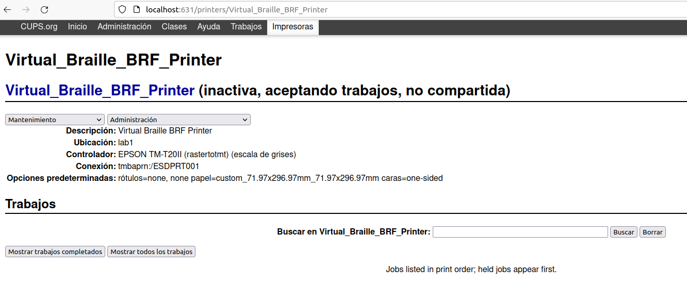
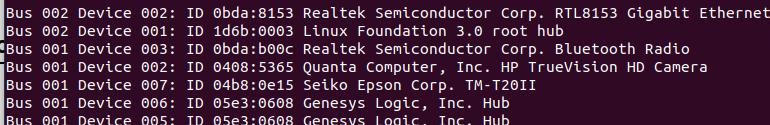

# fall_detection
Use of Kafka and Spark for event streaming processing to detect falls in elderly people

The objective of this project is to be able to receive and process events via streaming using Kafka and Spark Streaming. In this way, we will receive the events through a topic called "sensors" and send them to another topic called "falls." In the first one, we will collect all the events, and in the second one, we will store the detected fall to be taken by the consumers. In our case, we will print the event.

1. Requeriments

Spark: 2.4.8 - hadoop 2.6
Kafka: 2.13-3.0.0
pyspark: 2.4.6
CUPS for print server or driver for your printer
python-escpos

Follow the instructions for setting up a print serve for your printer under your Operative System .

You will need to get the ID of your USB port with the lsusb command. Modify accordingly.< in the consumer.py>

1. Create the kafka topics "sensors" and "falls":
bin/kafka-topics.sh --bootstrap-server localhost:9092 --create --topic sensors
--partitions 1 --replication-factor 1

bin/kafka-topics.sh --bootstrap-server localhost:9092 --create --topic falls
--partitions 1 --replication-factor 1

2. Start the zookeeper:
bin/zookeeper-server-start.sh config/zookeeper.properties

4. Start the kafka server:
bin/kafka-server-start.sh config/server.properties

5. Start the Web app server:
python3 getaway.py

6. Start the detector server:
bin/spark-submit --jars spark-streaming-kafka-0-8-assembly_2.11-2.4.8.jar /location/detector.py

7. Start the consumer and printer server:
python3 consumer.py

